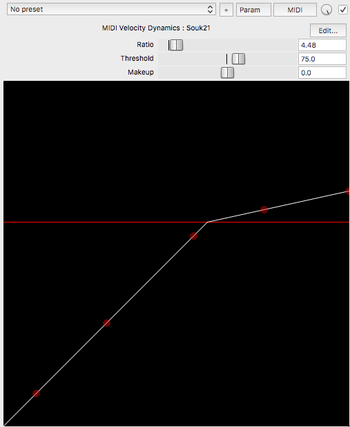
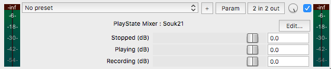

# JSFX and scripts for Reaper DAW

ReaPack link:

    https://raw.githubusercontent.com/Souk21/REAPER-scripts-and-effects/master/index.xml

## Scripts

- [Set block (buffer) size](https://forum.cockos.com/showthread.php?t=264010)
- [Key Sequences](https://forum.cockos.com/showthread.php?t=269134)
- Rename FX Instance

## MIDI Velocity Compressor

Scale velocity with a 'compressor-like' display

## PlayState Mixer

Applies a different gain to the track depending on if transport is playing, stopped or recording

